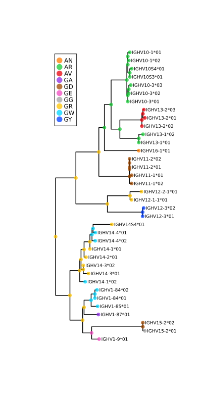

# Examples

## Example 1: Amino acid ancestral reconstruction and visualization

This example reads amino acid sequences from [this FASTA file](https://raw.githubusercontent.com/MurrellGroup/MolecularEvolution.jl/main/docs/src/MusAA_IGHV.fasta), and a phylogeny from [this Newick tree file](https://raw.githubusercontent.com/MurrellGroup/MolecularEvolution.jl/main/docs/src/MusAA_IGHV.tre). A [WAG](https://www.ebi.ac.uk/goldman-srv/WAG/) amino acid model, augmented to explicitly model gap (ie. '-') characters, and a global substitution rate is estimated by maximum likelihood. Under this optimized model, the distribution over ancestral amino acids is constructed for each node, and visualized in multiple ways.

```julia
using MolecularEvolution, FASTX, Phylo, Plots

#Read in seqs and tree
seqnames, seqs = read_fasta("Data/MusAA_IGHV.fasta")
tree = read_newick_tree("Data/MusAA_IGHV.tre")

#Compute AA freqs, which become the equilibrium freqs of the model, and the initial root freqs
AA_freqs = char_proportions(seqs,MolecularEvolution.gappyAAstring)
#Build the Q matrix
Q = gappy_Q_from_symmetric_rate_matrix(WAGmatrix,1.0,AA_freqs)
#Build the model
m = DiagonalizedCTMC(Q)
#Set up the memory on the tree
initial_partition = GappyAminoAcidPartition(AA_freqs,length(seqs[1]))
populate_tree!(tree,initial_partition,seqnames,seqs)

#Set up a likelihood function to find the scaling constant that best fits the branch lengths of the imported tree
#Note, calling LL will change the rate, so make sure you set it to what you want after this has been called
ll = function(rate; m = m)
    m.r = rate
    return log_likelihood!(tree,m)
end
opt_rate = golden_section_maximize(ll, 0.0, 10.0, identity, 1e-11);
plot(opt_rate*0.87:0.001:opt_rate*1.15,ll,size = (500,250),
    xlabel = "rate",ylabel = "log likelihood", legend = :none)
```


Then set the model parameters to the maximum likelihood estimate, and reconstruct the ancestral states.

```julia
m.r = opt_rate
#Reconstructing the marginal distributions of amino acids at internal nodes
d = marginal_state_dict(tree,m)
```

That's it! Everything else is for visualizing these ancestral states. We'll select a set of amino acid positions to visualize, corresponding to these two (red arrows) alignment columns:


```julia
#The alignment indices we want to pay attention to in our reconstructions
motif_inds = [52,53]

#We'll compute a confidence score for the inferred marginal state
confidence(state,inds) = minimum([maximum(state[:,i]) for i in inds])

#Map motifs to numbers, so we can work with more convenient continuous color scales
all_motifs = sort(union([partition2obs(d[n][1])[motif_inds] for n in getnodelist(tree)]))
motif2num = Dict(zip(all_motifs,1:length(all_motifs)))

#Populating the node_data dictionary to help with plotting
for n in getnodelist(tree)
    moti = partition2obs(d[n][1])[motif_inds]
    n.node_data = Dict([
            "motif"=>moti,
            "motif_color"=>motif2num[moti],
            "uncertainty"=>1-confidence(d[n][1].state,motif_inds)
            ])
end

#Transducing the MolecularEvolution FelNode tree to a Phylo.jl tree, which migrates node_data as well
phylo_tree = get_phylo_tree(tree)
node_unc = values_from_phylo_tree(phylo_tree,"uncertainty")

println("Greatest motif uncertainty: ",maximum([n.node_data["uncertainty"] for n in getnodelist(tree)]))
```
```
Greatest motif uncertainty: 0.6104376723068156
```

```julia
#Plotting, using discrete marker colors
pl = plot(phylo_tree,
    showtips = true, tipfont = 6, marker_group = "motif", palette = :seaborn_bright,
    markeralpha = 0.75, markerstrokewidth = 0, margins = 2Plots.cm, legend = :topleft,
    linewidth = 1.5, size = (400, 800))

savefig_tweakSVG("anc_tree_with_legend.svg", pl)
pl
```




```julia
#Plotting, using discrete marker colors
pl = plot(phylo_tree, treetype = :fan,
    showtips = true, tipfont = 6, marker_group = "motif", palette = :seaborn_bright,
    markeralpha = 0.75, markerstrokewidth = 0, margins = 2Plots.cm, legend = :topleft,
    linewidth = 1.5, size = (800, 800))

savefig_tweakSVG("anc_circ_tree_with_legend.svg", pl)
pl
```


```julia
#Plotting using continuous color scales, and using marker size to show uncertainty in reconstructions
color_scale = :rainbow
pl = plot(phylo_tree, showtips = true, tipfont = 6, marker_z = "motif_color", line_z = "motif_color",
    markersize = 10 .* sqrt.(node_unc), linecolor = color_scale, markercolor = color_scale, markeralpha = 0.75,
    markerstrokewidth = 0,margins = 2Plots.cm, colorbar = :none, linewidth = 2.5,  size = (400, 800))

#Feeble attempt at a manual legend
motif_ys = collect(1:length(all_motifs)) .+ (length(seqs) - length(all_motifs))
scatter!(zeros(length(all_motifs)) , motif_ys , marker = 8, markeralpha = 0.75,
        marker_z = 1:length(all_motifs), markercolor = color_scale, markerstrokewidth = 0.0)
for i in 1:length(all_motifs)
    annotate!(0.1, motif_ys[i], all_motifs[i],7)
end

savefig_tweakSVG("anc_tree_continuous.svg", pl)
pl
```


## Example 2: GTR+Gamma

For site-to-site "random effects" rate variation, such as under the GTR+Gamma model, we need to use a "Site-Wise Mixture" model, or `SWMModel` with its `SWMPartition`.

```julia
#Set up a function that will return a set of rates that will, when equally weighted, VERY coarsely approx a Gamma distribution
function equiprobable_gamma_grids(s,k)
    grids = quantile(Gamma(s,1/s),1/2k:1/k:(1-1/2k))
    grids ./ mean(grids)
end

#Read in seqs and tree, and populate the three  NucleotidePartitions
seqnames, seqs = read_fasta("Data/MusNuc_IGHV.fasta")
tree = read_newick_tree("Data/MusNuc_IGHV.tre")

#Set up the Partition that will be replicated in the SWMModel
initial_partition = NucleotidePartition(length(seqs[1]))

#To be able to use unconstrained optimization, we use `ParameterHandling.jl`
initial_params = (
        rates=positive(ones(6)),
        gam_shape=positive(1.0),
        pi=zeros(3)
)
flat_initial_params, unflatten = value_flatten(initial_params)
num_params = length(flat_initial_params)

#Setting up the Site-Wise Mixture Partition:
#Note: this constructor sets the weights of all categories to 1/rate_cats
#That is fine for our equi-probable category model, but this will need to be different for other models.
rate_cats = 5
REL_partition = MolecularEvolution.SWMPartition{NucleotidePartition}(initial_partition,rate_cats)
populate_tree!(tree,REL_partition,seqnames,seqs)

function build_model_vec(params; cats = rate_cats)
    r_vals = equiprobable_gamma_grids(params.gam_shape,cats)
    pi = unc2probvec(params.pi)
    return MolecularEvolution.SWMModel(DiagonalizedCTMC(reversibleQ(params.rates,pi)),r_vals)
end

function objective(params::NamedTuple; tree = tree)
    v = unc2probvec(params.pi)
    #Root freqs need to be set over all component partitions
    for p in tree.parent_message[1].parts
        p.state .= v
    end
    return -log_likelihood!(tree,build_model_vec(params))
end

opt = Opt(:LN_BOBYQA, num_params)

min_objective!(opt, (x,y) -> (objective ∘ unflatten)(x))
lower_bounds!(opt, [-5.0 for i in 1:num_params])
upper_bounds!(opt, [5.0 for i in 1:num_params])
xtol_rel!(opt, 1e-12)
score,mini,did_it_work = NLopt.optimize(opt, flat_initial_params)

final_params = unflatten(mini)
optimized_model = build_model_vec(final_params)
LL = log_likelihood!(tree,optimized_model)
println(did_it_work)
println("Opt LL:",LL)
```
```
SUCCESS
Opt LL:-3728.4761606135307
```
Other functions also work with these kinds of random-effects site-wise mixture models:
```julia
tree_polish!(tree,optimized_model)
```
```
LL: -3728.4761606135307
LL: -3728.1316616075173
LL: -3728.121005993758
LL: -3728.1202243978914
LL: -3728.1201348447107
```

Sometimes we might want the rate values for each category to stay fixed, but optimize their weights:
```julia
#Using rate categories with fixed values
fixed_cats = [0.00001,0.33,1.0,3.0,9.0]

seqnames, seqs = read_fasta("Data/MusNuc_IGHV.fasta")
tree = read_newick_tree("Data/MusNuc_IGHV.tre")

initial_partition = NucleotidePartition(length(seqs[1]))

initial_params = (
        rates=positive(ones(6)),
        cat_weights=zeros(length(fixed_cats)-1), #Category weights
        pi=zeros(3) #Nuc freqs
)
flat_initial_params, unflatten = value_flatten(initial_params)
num_params = length(flat_initial_params)

REL_partition = MolecularEvolution.SWMPartition{NucleotidePartition}(initial_partition,length(fixed_cats))
populate_tree!(tree,REL_partition,seqnames,seqs)

function build_model_vec(params; cats = fixed_cats)
    cat_weights = unc2probvec(params.cat_weights)
    pi = unc2probvec(params.pi)
    m = MolecularEvolution.SWMModel(DiagonalizedCTMC(reversibleQ(params.rates,pi)),cats)
    m.weights .= cat_weights
    return m
end

function objective(params::NamedTuple; tree = tree)
    v = unc2probvec(params.pi)
    for p in tree.parent_message[1].parts
        p.state .= v
    end
    return -log_likelihood!(tree,build_model_vec(params))
end

opt = Opt(:LN_BOBYQA, num_params)

min_objective!(opt, (x,y) -> (objective ∘ unflatten)(x))
lower_bounds!(opt, [-5.0 for i in 1:num_params])
upper_bounds!(opt, [5.0 for i in 1:num_params])
xtol_rel!(opt, 1e-12)
score,mini,did_it_work = NLopt.optimize(opt, flat_initial_params)

final_params = unflatten(mini)
optimized_model = build_model_vec(final_params)
LL = log_likelihood!(tree,optimized_model)

println(did_it_work)
println("Opt LL:",LL)
```
```
SUCCESS
Opt LL:-3719.6290948420706
```