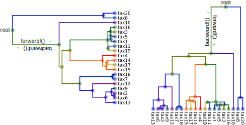
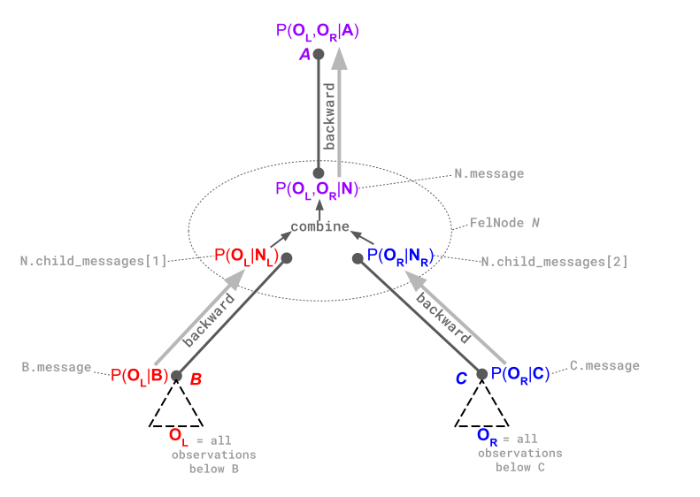

# The MolecularEvolution.jl Framework

The organizing principle is that the core algorithms, including Felsenstein's algorithm, but also a related family of message passing algorithms and inference machinery, are implemented in a way that does not refer to any specific model or even to any particular data type.

## Partitions and BranchModels

A ```Partition``` is a probabilistic representation of some kind of state. Specifically, it needs to be able to represent P(obs|state) and P(obs,state) when considered as functions of state. So it will typically be able to assign a probability to any possible value of state, and is unnormalized - not required to sum or integrate to 1 over all values of state. As an example, for a discrete state with 4 categories, this could just be a vector of 4 numbers.

For a ```Partition``` type to be usable by MolecularEvolution.jl, the ```combine!``` function needs to be implemented. If you have P(obsA|state) and P(obsB|state), then ```combine!``` calculates P(obsA,obsB|state) under the assumption that obsA and obsB are conditionally independent given state. ```MolecularEvolution.jl``` tries to avoid allocating memory, so ```combine!(dest,src)``` places in ```dest``` the combined ```Partition``` in ```dest```. For a discrete state with 4 categories, this is simply element-wise multiplication of two state vectors.

A ```BranchModel``` defines how ```Partition``` distributions evolve along branches. Two functions need to be implemented: ```backward!``` and ```forward!```. We imagine our trees with the root at the top, and ```forward!``` moves from root to tip, and ```backward!``` moves from tip to root. ```backward!(dest::P,src::P,m::BranchModel,n::FelNode)``` takes a src Partition, representing P(obs-below|state-at-bottom-of-branch), and modifies the dest Partition to be P(obs-below|state-at-top-of-branch), where the branch in question is the branch above the ```FelNode``` n. ```forward!``` goes in the opposite direction, from P(obs-above,state-at-top-of-branch) to P(obs-above,state-at-bottom-of-branch), with the ```Partitions``` now, confusingly, representing joint distributions.



## Messages

Nodes on our trees work with messages, where a ```message``` is a vector of ```Partition``` structs. This is in case you wish to model multiple different data types on the same tree. Often, all the messages on the tree will just be arrays containing a single ```Partition```, but if you're accessing them you need to remember that they're in an array!

## Trees

Each node in our tree is a ```FelNode``` ("Fel" for "Felsenstein"). They point to their parent nodes, and an array of their children, and they store their main vector of ```Partition```s, but also cached versions of those from their parents and children, to allow certain message passing schemes. They also have a ```branchlength``` field, which tells eg. ```forward!``` and ```backward!``` how much evolution occurs along the branch above (ie. closer to the root) that node. They also allow for an arbitrary dictionary of ```node_data```, in case a model needs any other branch-specific parameters.

The set of algorithms needs to know which model to use for which partition, so the assumption made is that they'll see an array of models whose order will match the partition array. In general, we might want the models to vary from one branch to another, so the central algorithms take a function that associates a ```FelNode->Vector{:<BranchModel}```. In the simpler cases where the model does not vary from branch to branch, or where there is only a single Partition, and thus a single model, the core algorithms have been overloaded to allow you to pass in a single model vector or a single model.

## Algorithms

Felsenstein's algorithm recursively computes, for each node, the probability of all observations below that node, given the state at that node. Felsenstein's algorithm can be decomposed into the following combination of `backward!` and `combine!` operations:



At the root node, we wind up with ``P(O_{all}|R)``, where ``R`` is the state at the root, and we can compute ``P(O_{all}) = \sum_{R} P(O_{all}|R) P(R)``.

## Technicalities

### Scaling constants

Coming soon.

### Root state

Coming soon.

## Functions

```@docs
combine!
forward!
backward!
```