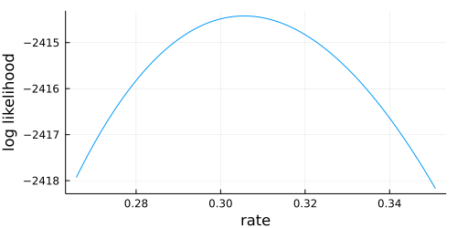
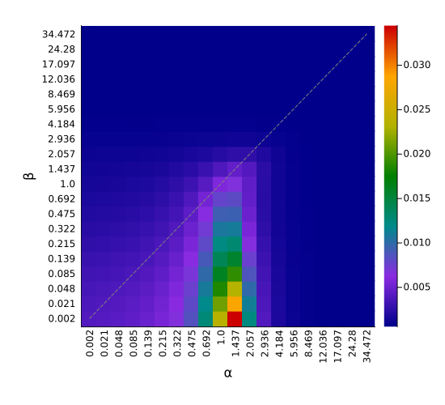
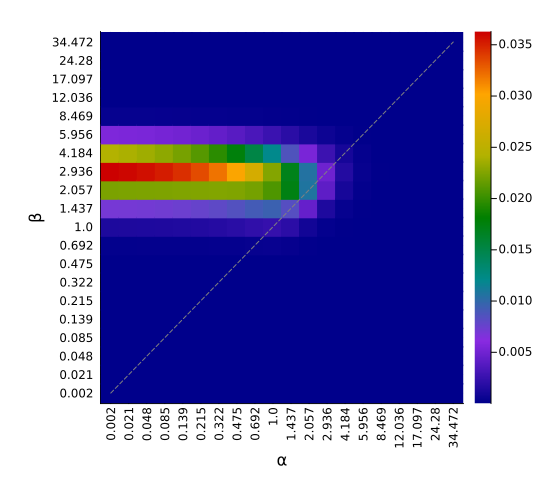

# Examples {#Examples}

## Example 1: Amino acid ancestral reconstruction and visualization {#Example-1:-Amino-acid-ancestral-reconstruction-and-visualization}

This example reads amino acid sequences from [this FASTA file](https://raw.githubusercontent.com/MurrellGroup/MolecularEvolution.jl/main/docs/src/MusAA_IGHV.fasta), and a phylogeny from [this Newick tree file](https://raw.githubusercontent.com/MurrellGroup/MolecularEvolution.jl/main/docs/src/MusAA_IGHV.tre). A [WAG](https://www.ebi.ac.uk/goldman-srv/WAG/) amino acid model, augmented to explicitly model gap (ie. &#39;-&#39;) characters, and a global substitution rate is estimated by maximum likelihood. Under this optimized model, the distribution over ancestral amino acids is constructed for each node, and visualized in multiple ways.

```julia
using MolecularEvolution, FASTX, Phylo, Plots

#Read in seqs and tree
seqnames, seqs = read_fasta("Data/MusAA_IGHV.fasta")
tree = read_newick_tree("Data/MusAA_IGHV.tre")

#Compute AA freqs, which become the equilibrium freqs of the model, and the initial root freqs
AA_freqs = char_proportions(seqs,MolecularEvolution.gappyAAstring)
#Build the Q matrix
Q = gappy_Q_from_symmetric_rate_matrix(WAGmatrix,1.0,AA_freqs)
#Build the model
m = DiagonalizedCTMC(Q)
#Set up the memory on the tree
initial_partition = GappyAminoAcidPartition(AA_freqs,length(seqs[1]))
populate_tree!(tree,initial_partition,seqnames,seqs)

#Set up a likelihood function to find the scaling constant that best fits the branch lengths of the imported tree
#Note, calling LL will change the rate, so make sure you set it to what you want after this has been called
ll = function(rate; m = m)
    m.r = rate
    return log_likelihood!(tree,m)
end
opt_rate = golden_section_maximize(ll, 0.0, 10.0, identity, 1e-11);
plot(opt_rate*0.87:0.001:opt_rate*1.15,ll,size = (500,250),
    xlabel = "rate",ylabel = "log likelihood", legend = :none)
```





Then set the model parameters to the maximum likelihood estimate, and reconstruct the ancestral states.

```julia
m.r = opt_rate
#Reconstructing the marginal distributions of amino acids at internal nodes
d = marginal_state_dict(tree,m)
```


That&#39;s it! Everything else is for visualizing these ancestral states. We&#39;ll select a set of amino acid positions to visualize, corresponding to these two (red arrows) alignment columns:


```julia
#The alignment indices we want to pay attention to in our reconstructions
motif_inds = [52,53]

#We'll compute a confidence score for the inferred marginal state
confidence(state,inds) = minimum([maximum(state[:,i]) for i in inds])

#Map motifs to numbers, so we can work with more convenient continuous color scales
all_motifs = sort(union([partition2obs(d[n][1])[motif_inds] for n in getnodelist(tree)]))
motif2num = Dict(zip(all_motifs,1:length(all_motifs)))

#Populating the node_data dictionary to help with plotting
for n in getnodelist(tree)
    moti = partition2obs(d[n][1])[motif_inds]
    n.node_data = Dict([
            "motif"=>moti,
            "motif_color"=>motif2num[moti],
            "uncertainty"=>1-confidence(d[n][1].state,motif_inds)
            ])
end

#Transducing the MolecularEvolution FelNode tree to a Phylo.jl tree, which migrates node_data as well
phylo_tree = get_phylo_tree(tree)
node_unc = values_from_phylo_tree(phylo_tree,"uncertainty")

println("Greatest motif uncertainty: ",maximum([n.node_data["uncertainty"] for n in getnodelist(tree)]))
```


```
Greatest motif uncertainty: 0.6104376723068156
```


```julia
#Plotting, using discrete marker colors
pl = plot(phylo_tree,
    showtips = true, tipfont = 6, marker_group = "motif", palette = :seaborn_bright,
    markeralpha = 0.75, markerstrokewidth = 0, margins = 2Plots.cm, legend = :topleft,
    linewidth = 1.5, size = (400, 800))

savefig_tweakSVG("anc_tree_with_legend.svg", pl)
pl
```


```julia
#Plotting, using discrete marker colors
pl = plot(phylo_tree, treetype = :fan,
    showtips = true, tipfont = 6, marker_group = "motif", palette = :seaborn_bright,
    markeralpha = 0.75, markerstrokewidth = 0, margins = 2Plots.cm, legend = :topleft,
    linewidth = 1.5, size = (800, 800))

savefig_tweakSVG("anc_circ_tree_with_legend.svg", pl)
pl
```


```julia
#Plotting using continuous color scales, and using marker size to show uncertainty in reconstructions
color_scale = :rainbow
pl = plot(phylo_tree, showtips = true, tipfont = 6, marker_z = "motif_color", line_z = "motif_color",
    markersize = 10 .* sqrt.(node_unc), linecolor = color_scale, markercolor = color_scale, markeralpha = 0.75,
    markerstrokewidth = 0,margins = 2Plots.cm, colorbar = :none, linewidth = 2.5,  size = (400, 800))

#Feeble attempt at a manual legend
motif_ys = collect(1:length(all_motifs)) .+ (length(seqs) - length(all_motifs))
scatter!(zeros(length(all_motifs)) , motif_ys , marker = 8, markeralpha = 0.75,
        marker_z = 1:length(all_motifs), markercolor = color_scale, markerstrokewidth = 0.0)
for i in 1:length(all_motifs)
    annotate!(0.1, motif_ys[i], all_motifs[i],7)
end

savefig_tweakSVG("anc_tree_continuous.svg", pl)
pl
```


## Example 2: GTR+Gamma {#Example-2:-GTRGamma}

For site-to-site &quot;random effects&quot; rate variation, such as under the GTR+Gamma model, we need to use a &quot;Site-Wise Mixture&quot; model, or `SWMModel` with its `SWMPartition`.

```julia
#Set up a function that will return a set of rates that will, when equally weighted, VERY coarsely approx a Gamma distribution
function equiprobable_gamma_grids(s,k)
    grids = quantile(Gamma(s,1/s),1/2k:1/k:(1-1/2k))
    grids ./ mean(grids)
end

#Read in seqs and tree, and populate the three  NucleotidePartitions
seqnames, seqs = read_fasta("Data/MusNuc_IGHV.fasta")
tree = read_newick_tree("Data/MusNuc_IGHV.tre")

#Set up the Partition that will be replicated in the SWMModel
initial_partition = NucleotidePartition(length(seqs[1]))

#To be able to use unconstrained optimization, we use `ParameterHandling.jl`
initial_params = (
        rates=positive(ones(6)),
        gam_shape=positive(1.0),
        pi=zeros(3)
)
flat_initial_params, unflatten = value_flatten(initial_params)
num_params = length(flat_initial_params)

#Setting up the Site-Wise Mixture Partition:
#Note: this constructor sets the weights of all categories to 1/rate_cats
#That is fine for our equi-probable category model, but this will need to be different for other models.
rate_cats = 5
REL_partition = MolecularEvolution.SWMPartition{NucleotidePartition}(initial_partition,rate_cats)
populate_tree!(tree,REL_partition,seqnames,seqs)

function build_model_vec(params; cats = rate_cats)
    r_vals = equiprobable_gamma_grids(params.gam_shape,cats)
    pi = unc2probvec(params.pi)
    return MolecularEvolution.SWMModel(DiagonalizedCTMC(reversibleQ(params.rates,pi)),r_vals)
end

function objective(params::NamedTuple; tree = tree)
    v = unc2probvec(params.pi)
    #Root freqs need to be set over all component partitions
    for p in tree.parent_message[1].parts
        p.state .= v
    end
    return -log_likelihood!(tree,build_model_vec(params))
end

opt = Opt(:LN_BOBYQA, num_params)

min_objective!(opt, (x,y) -> (objective ∘ unflatten)(x))
lower_bounds!(opt, [-5.0 for i in 1:num_params])
upper_bounds!(opt, [5.0 for i in 1:num_params])
xtol_rel!(opt, 1e-12)
score,mini,did_it_work = NLopt.optimize(opt, flat_initial_params)

final_params = unflatten(mini)
optimized_model = build_model_vec(final_params)
LL = log_likelihood!(tree,optimized_model)
println(did_it_work)
println("Opt LL:",LL)
```


```
SUCCESS
Opt LL:-3728.4761606135307
```


Other functions also work with these kinds of random-effects site-wise mixture models:

```julia
tree_polish!(tree,optimized_model)
```


```
LL: -3728.4761606135307
LL: -3728.1316616075173
LL: -3728.121005993758
LL: -3728.1202243978914
LL: -3728.1201348447107
```


Sometimes we might want the rate values for each category to stay fixed, but optimize their weights:

```julia
#Using rate categories with fixed values
fixed_cats = [0.00001,0.33,1.0,3.0,9.0]

seqnames, seqs = read_fasta("Data/MusNuc_IGHV.fasta")
tree = read_newick_tree("Data/MusNuc_IGHV.tre")

initial_partition = NucleotidePartition(length(seqs[1]))

initial_params = (
        rates=positive(ones(6)),
        cat_weights=zeros(length(fixed_cats)-1), #Category weights
        pi=zeros(3) #Nuc freqs
)
flat_initial_params, unflatten = value_flatten(initial_params)
num_params = length(flat_initial_params)

REL_partition = MolecularEvolution.SWMPartition{NucleotidePartition}(initial_partition,length(fixed_cats))
populate_tree!(tree,REL_partition,seqnames,seqs)

function build_model_vec(params; cats = fixed_cats)
    cat_weights = unc2probvec(params.cat_weights)
    pi = unc2probvec(params.pi)
    m = MolecularEvolution.SWMModel(DiagonalizedCTMC(reversibleQ(params.rates,pi)),cats)
    m.weights .= cat_weights
    return m
end

function objective(params::NamedTuple; tree = tree)
    v = unc2probvec(params.pi)
    for p in tree.parent_message[1].parts
        p.state .= v
    end
    return -log_likelihood!(tree,build_model_vec(params))
end

opt = Opt(:LN_BOBYQA, num_params)

min_objective!(opt, (x,y) -> (objective ∘ unflatten)(x))
lower_bounds!(opt, [-5.0 for i in 1:num_params])
upper_bounds!(opt, [5.0 for i in 1:num_params])
xtol_rel!(opt, 1e-12)
score,mini,did_it_work = NLopt.optimize(opt, flat_initial_params)

final_params = unflatten(mini)
optimized_model = build_model_vec(final_params)
LL = log_likelihood!(tree,optimized_model)

println(did_it_work)
println("Opt LL:",LL)
```


```
SUCCESS
Opt LL:-3719.6290948420706
```


When you have a Site-Wise Mixture (ie. REL) model, the category weights can be handled &quot;outside&quot; of the main likelihood calculations. This means that they can be optimized very quickly, within an objective function that is optimizing over the other parameters. The following example uses an EM approach to do this:

```julia
using Distributions, FASTX, ParameterHandling, NLopt

#Using rate categories with fixed values
fixed_cats = [(i/5)^2 for i in 1:12]

seqnames, seqs = read_fasta("Data/MusNuc_IGHV.fasta")
tree = read_newick_tree("Data/MusNuc_IGHV.tre")

initial_partition = NucleotidePartition(length(seqs[1]))

initial_params = (
        rates=positive(ones(6)),
        pi=zeros(3) #Nuc freqs
)
flat_initial_params, unflatten = value_flatten(initial_params)
num_params = length(flat_initial_params)

REL_partition = MolecularEvolution.SWMPartition{NucleotidePartition}(initial_partition,length(fixed_cats))
populate_tree!(tree,REL_partition,seqnames,seqs)

function build_model_vec(params; cats = fixed_cats)
    pi = unc2probvec(params.pi)
    m = SWMModel(DiagonalizedCTMC(reversibleQ(params.rates,pi)),cats)
    return m
end

#LL for a mixture when the grid of probabilities is pre-computed
grid_ll(v,g) = sum(log.(sum((v./sum(v)) .* g,dims = 1)))

#Note: we can get away with relatively few EM iterations within the optimization cycle (in this example at least)
function opt_weights_and_LL(temp_part::SWMPartition{PType}; iters = 25) where {PType <: MolecularEvolution.MultiSitePartition}    
    g,scals = SWM_prob_grid(temp_part) 
    l = size(g)[1]
    #We can optimize the category weights without re-computing felsenstein
    #So it can make sense to do so within the optimization function
    #Which means you don't need to optimize over as many parameters
    θ = weightEM(g,ones(l)./l, iters = iters)
    LL_optimizing_over_weights = grid_ll(θ,g) + sum(scals)
    return θ,LL_optimizing_over_weights
end

function objective(params::NamedTuple; tree = tree)
    v = unc2probvec(params.pi)
    for p in tree.parent_message[1].parts
        p.state .= v
    end
    felsenstein!(tree,build_model_vec(params))
    #Optim inside optim
    #We first need to handle the merge of the parent and root partitions - usually handled for us magically!
    #Be careful: this example is hard-coded for a single partition
    temp_part = copy_partition(tree.parent_message[1])
    combine!(temp_part, tree.message[1])
    θ,LL = opt_weights_and_LL(temp_part)
    return -LL
end

opt = Opt(:LN_BOBYQA, num_params)

min_objective!(opt, (x,y) -> (objective ∘ unflatten)(x))
lower_bounds!(opt, [-5.0 for i in 1:num_params])
upper_bounds!(opt, [5.0 for i in 1:num_params])
xtol_rel!(opt, 1e-12)
@time score,mini,did_it_work = NLopt.optimize(opt, flat_initial_params)

final_params = unflatten(mini)
optimized_model = build_model_vec(final_params)

felsenstein!(tree,optimized_model)
temp_part = copy_partition(tree.parent_message[1])
combine!(temp_part, tree.message[1])
θ,_ = opt_weights_and_LL(temp_part, iters = 1000) #polish weights for final pass - quick
optimized_model.weights .= θ
LL = log_likelihood!(tree,optimized_model)

println(did_it_work, ":", score)
println("Opt LL:",LL)
```


```
3.932150 seconds (2.38 M allocations: 2.378 GiB, 10.78% gc time, 3.28% compilation time: 7% of which was recompilation)
SUCCESS:3720.1347720900067
Opt LL:-3719.4808937732614
```


This can be dramatically faster than trying to directly optimize over category weights when the number of categories grows. The above example took 140s with the direct approach.

## Example 3: FUBAR {#Example-3:-FUBAR}

This example reads codon sequences from [this FASTA file](https://raw.githubusercontent.com/MurrellGroup/MolecularEvolution.jl/main/docs/src/Flu.fasta), and a phylogeny from [this Newick tree file](https://raw.githubusercontent.com/MurrellGroup/MolecularEvolution.jl/main/docs/src/Flu.tre), and implements [`FUBAR`](https://academic.oup.com/mbe/article/30/5/1196/998247).

```julia
using MolecularEvolution, FASTX, ParameterHandling, NLopt, Plots

#Read in seqs and tree
seqnames, seqs = read_fasta("Data/Flu.fasta")
tree = read_newick_tree("Data/Flu.tre")

#Count F3x4 frequencies from the seqs, and estimate codon freqs from this
f3x4 = MolecularEvolution.count_F3x4(seqs);
eq_freqs = MolecularEvolution.F3x4_eq_freqs(f3x4);

#Set up a codon partition (will default to Universal genetic code)
initial_partition = CodonPartition(Int64(length(seqs[1])/3))
initial_partition.state .= eq_freqs
populate_tree!(tree,initial_partition,seqnames,seqs)

#We'll use the empirical F3x4 freqs, fixed MG94 alpha=1, and optimize the nuc parameters and MG94 beta
#Note: the nuc rates are confounded with alpha
initial_params = (
        rates=positive(ones(6)), #rates must be non-negative
        beta = positive(1.0)
)
flat_initial_params, unflatten = value_flatten(initial_params) #See ParameterHandling.jl docs
num_params = length(flat_initial_params)

function build_model_vec(p; F3x4 = f3x4, alpha = 1.0)
    #If you run into numerical issues with DiagonalizedCTMC, switch to GeneralCTMC instead
    return DiagonalizedCTMC(MolecularEvolution.MG94_F3x4(alpha, p.beta, reversibleQ(p.rates,ones(4)), F3x4))
end

function objective(params::NamedTuple; tree = tree, eq_freqs = eq_freqs)
    return -log_likelihood!(tree,build_model_vec(params))
end

opt = Opt(:LN_BOBYQA, num_params)
min_objective!(opt, (x,y) -> (objective ∘ unflatten)(x))
lower_bounds!(opt, [-5.0 for i in 1:num_params])
upper_bounds!(opt, [5.0 for i in 1:num_params])
xtol_rel!(opt, 1e-12)
@time _,mini,_ = NLopt.optimize(opt, flat_initial_params)

final_params = unflatten(mini)
nucmat = reversibleQ(final_params.rates,ones(4))
```


```
 10.596546 seconds (840.87 k allocations: 5.221 GiB, 7.45% gc time, 0.35% compilation time: 25% of which was recompilation)
4×4 Matrix{Float64}:
 -9.41346    1.77048    6.85997    0.783008
  1.77048   -7.24162    0.280525   5.19061
  6.85997    0.280525  -8.651      1.5105
  0.783008   5.19061    1.5105    -7.48412
```


The scaling of that nuc matrix reflects the fact that the we&#39;re using a tree that was estimated under a nuc model, but here we&#39;re optimizing a codon model. No issue: the nuc rates have absorbed this scaling difference.

Now we set up a 20-by-20 grid, slicing the MG94 α and β parameters at the following values:

```julia
grid_values = 10 .^ (-1.35:0.152:1.6) .- 0.0423174293933042
```


```
20-element Vector{Float64}:
  0.0023509298217921012
  0.021069541732388508
  0.047632328759699305
  0.08532645148783018
  0.13881657986865603
  0.2147221488835822
  0.3224365175323036
  0.4752894025572635
  0.6921964387638108
  1.0
  1.4367909587749033
  2.05662245423022
  2.9361990000358853
  4.184368713262725
  5.95559333316179
  8.469062952630463
 12.0358209216745
 17.09725564569095
 24.27972266134484
 34.47205650419232
```


Then we calculate the conditional likelihoods for each site. Note the 20-by-20 grid is stretched out into a length 400 vector to keep things simple. I&#39;m avoiding `reshape` tricks to keep the grid structure clear.

```julia
LL_matrix = zeros(length(grid_values)^2,initial_partition.sites);
alpha_vec = zeros(length(grid_values)^2);
alpha_ind_vec = zeros(Int64,length(grid_values)^2);
beta_vec = zeros(length(grid_values)^2);
beta_ind_vec = zeros(Int64,length(grid_values)^2);

i = 1
@time for (a,alpha) in enumerate(grid_values)
    for (b,beta) in enumerate(grid_values)
        alpha_vec[i],beta_vec[i] = alpha, beta
        alpha_ind_vec[i], beta_ind_vec[i] = a,b
        m = DiagonalizedCTMC(MolecularEvolution.MG94_F3x4(alpha, beta, nucmat, f3x4))
        felsenstein!(tree,m)
        #This is because we need to include the eq freqs in the site LLs:
        combine!(tree.message[1],tree.parent_message[1])
        LL_matrix[i,:] .= MolecularEvolution.site_LLs(tree.message[1])
        i += 1
    end
end
prob_matrix = exp.(LL_matrix .- maximum(LL_matrix,dims = 1))
prob_matrix ./= sum(prob_matrix,dims = 1);
```


Then we use an EM-like MAP algorithm to find the posterior grid weights, and visualize this surface:

```julia
LDAθ = weightEM(prob_matrix, ones(length(alpha_vec))./length(alpha_vec), conc = 0.4, iters = 5000);

#A function to viz the grid surface
function gridplot(alpha_ind_vec,beta_ind_vec,grid_values,θ; title = "")
    scatter(alpha_ind_vec,beta_ind_vec, zcolor = θ, c = :darktest,
    markersize = sqrt(length(alpha_ind_vec))/2, markershape=:square, markerstrokewidth=0.0, size=(550,500),
    label = :none, xticks = (1:length(grid_values), round.(grid_values,digits = 3)), xrotation = 90,
    yticks = (1:length(grid_values), round.(grid_values,digits = 3)), margin=6Plots.mm,
    xlabel = "α", ylabel = "β", title = title)
    plot!(1:length(grid_values),1:length(grid_values),color = "grey", style = :dash, label = :none)
end

gridplot(alpha_ind_vec,beta_ind_vec,grid_values,LDAθ)
```





We can see that the posterior distribution over sites is heavily concentrated at β&lt;α. But are there any sites where β&gt;α?

```julia
weighted_mat = prob_matrix .* LDAθ
for site in 1:size(prob_matrix)[2]
    pos = sum(weighted_mat[beta_vec .> alpha_vec,site])/sum(weighted_mat[:,site])
    if pos > 0.9
        println("Site $(site): P(β>α)=$(round(pos,digits = 4))")
    end
end
```


```
Site 153: P(β>α)=0.9074
Site 158: P(β>α)=0.9266
Site 160: P(β>α)=0.9547
```


And let&#39;s visualize one of those sites:

```julia
gridplot(alpha_ind_vec,beta_ind_vec,grid_values, weighted_mat[:,160]./sum(weighted_mat[:,160]))
```




