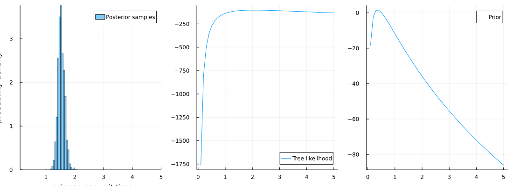
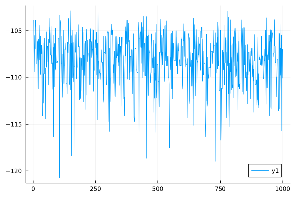
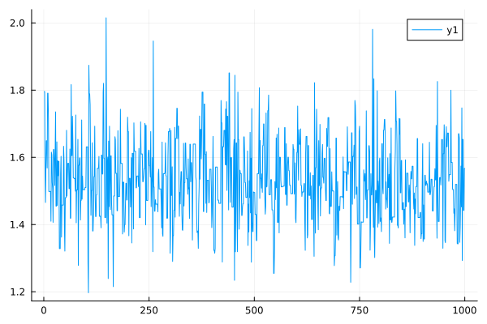

# Updating a phylogenetic tree {#Updating-a-phylogenetic-tree}

## Interface {#Interface}
<details class='jldocstring custom-block' open>
<summary><a id='MolecularEvolution.AbstractUpdate-generated-update' href='#MolecularEvolution.AbstractUpdate-generated-update'><span class="jlbinding">MolecularEvolution.AbstractUpdate</span></a> <Badge type="info" class="jlObjectType jlType" text="Type" /></summary>


**Summary**

`abstract type AbstractUpdate <: Function`

A callable type that typically takes `(tree::FelNode, models; partition_list=1:length(tree.message))`, updates `tree` and `models`, and returns the updated `tree` and `models`.

**Example**

Define a new subtype, where `foo` and `bar` are arbitrary updating functions

```julia
struct MyUpdate <: AbstractUpdate end

function (update::MyUpdate)(tree::FelNode, models; partition_list=1:length(tree.message))
    tree, models = foo(tree, models, partition_list=partition_list)
    tree, models = BayesUpdate(nni=0)(tree, models, partition_list=partition_list)
    tree, models = bar(tree, models, partition_list=partition_list)
    return tree, models
end
```


See also: [`StandardUpdate`](/api#MolecularEvolution.StandardUpdate)


<Badge type="info" class="source-link" text="source"><a href="https://github.com/MurrellGroup/MolecularEvolution.jl/blob/e2c752a0b1a5fa2ca25a6c4589b6e4bb030ee730/src/core/algorithms/AbstractUpdate.jl#L1-L20" target="_blank" rel="noreferrer">source</a></Badge>

</details>

<details class='jldocstring custom-block' open>
<summary><a id='MolecularEvolution.StandardUpdate-generated-update' href='#MolecularEvolution.StandardUpdate-generated-update'><span class="jlbinding">MolecularEvolution.StandardUpdate</span></a> <Badge type="info" class="jlObjectType jlType" text="Type" /></summary>


**Summary**

`struct StandardUpdate <: AbstractUpdate`

A standard update can be a family of calls to [`nni_update!`](/api#MolecularEvolution.nni_update!-Tuple{Function,%20FelNode,%20Any}), [`branchlength_update!`](/api#MolecularEvolution.branchlength_update!-Tuple{MolecularEvolution.UnivariateModifier,%20FelNode,%20Any}), [`root_update!`](/api#MolecularEvolution.root_update!-Tuple{RootUpdate,%20FelNode,%20Any}), and model updates.

**Constructor**

```
StandardUpdate(
    nni::Int,
    branchlength::Int,
    root::Int,
    models::Int,
    refresh::Bool,
    nni_selection::Function,
    branchlength_modifier::UnivariateModifier,
    root_update::RootUpdate,
    models_update::ModelsUpdate
)
```


**Arguments**
- `nni::Int`: the number of times to update the tree by `nni_update!`
  
- `branchlength::Int`: the number of times to update the tree by `branchlength_update!`
  
- `root::Int`: the number of times to update the tree by `root_update!`
  
- `models::Int`: the number of times to update the model
  
- `refresh::Bool`: whether to refresh the messages in tree between update operations to ensure message consistency
  
- `nni_selection::Function`: the function that selects between nni configurations
  
- `branchlength_modifier::UnivariateModifier`: the modifier to update a branchlength by `branchlength_update!`
  
- `root_update::RootUpdate`: updates the root by `root_update!`
  
- `models_update::ModelsUpdate`: updates the model parameters
  

See also: [`BayesUpdate`](/api#MolecularEvolution.BayesUpdate-Tuple{}), [`MaxLikUpdate`](/api#MolecularEvolution.MaxLikUpdate-Tuple{})


<Badge type="info" class="source-link" text="source"><a href="https://github.com/MurrellGroup/MolecularEvolution.jl/blob/e2c752a0b1a5fa2ca25a6c4589b6e4bb030ee730/src/core/algorithms/AbstractUpdate.jl#L23-L53" target="_blank" rel="noreferrer">source</a></Badge>

</details>


## Example {#Example}

```julia
using MolecularEvolution, Plots, Distributions
```


Simulate a tree

```julia
tree = sim_tree(n = 50)
initial_message = GaussianPartition()
models = BrownianMotion(0.0, 1.0)
internal_message_init!(tree, initial_message)
sample_down!(tree, models)
log_likelihood!(tree, models)
```


```
-50.84499517982202
```


Add some noise to the branch lengths

```julia
for n in getnodelist(tree)
    n.branchlength += 100 * rand()
end
log_likelihood!(tree, models)
```


```
-162.3049836882663
```


Optimize under the brownian motion model

```julia
update = MaxLikUpdate(branchlength = 1, nni = 0, root = 1)
tree, models = update(tree, models)
@show log_likelihood!(tree, models)
```


```
-29.090588656763885
```


### Set up a Bayesian model sampler {#Set-up-a-Bayesian-model-sampler}

Let&#39;s assume the target of inference is not the tree itself, but rather the models. Assume further that you want to, for a fixed mean drift, sample the variance of the brownian motion model, with the metropolis algorithm. We begin with a struct that defines the model and how it&#39;s updated

```julia
tree = sim_tree(n = 200)
internal_message_init!(tree, GaussianPartition())
#Simulate brownian motion over the tree
models = BrownianMotion(0.0, 2.0)
sample_down!(tree, models)
mutable struct MyModelSampler{
    T1<:ContinuousUnivariateDistribution,
    T2<:ContinuousUnivariateDistribution,
} <: ModelsUpdate
    acc_ratio::Tuple{Float64, Int64, Int64}
    log_var_drift_proposal::T1
    log_var_drift_prior::T2
    mean_drift::Float64
    function MyModelSampler(
        log_var_drift_proposal::T1,
        log_var_drift_prior::T2,
        mean_drift::Float64,
    ) where {T1<:ContinuousUnivariateDistribution, T2<:ContinuousUnivariateDistribution}
        new{T1, T2}((0.0, 0, 0), log_var_drift_proposal, log_var_drift_prior, mean_drift)
    end
end
```


Then we let this struct implement our [`metropolis_step`](/api#MolecularEvolution.metropolis_step-Tuple{Function,%20Any,%20Any}) interface

```julia
MolecularEvolution.tr(::MyModelSampler, x::BrownianMotion) = log(x.var_drift)
MolecularEvolution.invtr(modifier::MyModelSampler, x::Float64) =
    BrownianMotion(modifier.mean_drift, exp(x))

MolecularEvolution.proposal(modifier::MyModelSampler, curr_value::Float64) =
    curr_value + rand(modifier.log_var_drift_proposal)
MolecularEvolution.log_prior(modifier::MyModelSampler, x::Float64) =
    logpdf(modifier.log_var_drift_prior, x)
```


Now we define what a model update is

```julia
function (update::MyModelSampler)(
    tree::FelNode,
    models::BranchModel;
    partition_list = 1:length(tree.message),
)
    models = metropolis_step(update, models) do x::BrownianMotion
        log_likelihood!(tree, x)
    end
    log_likelihood!(tree, models, partition_list = partition_list) #refresh messages
    return models
end
```


Now we define how the model is collapsed to its parameter

```julia
function MolecularEvolution.collapse_models(::MyModelSampler, models::BranchModel)
    return models.var_drift
end
```


Now we define a Bayesian sampler

```julia
update = BayesUpdate(
    nni = 0,
    branchlength = 0,
    models = 1,
    refresh = true,
    models_sampler = MyModelSampler(Normal(0.0, 1.0), Normal(-1.0, 0.2), 0.0),
)
trees, LLs, models_samples = metropolis_sample(
    update,
    tree,
    BrownianMotion(0.0, 7.67),
    1000,
    burn_in = 1000,
    collect_LLs = true,
    collect_models = true,
)

ll(x) = log_likelihood!(tree, BrownianMotion(0.0, x))
prior(x) = logpdf(update.models_update.log_var_drift_prior, log(x)) - log(x)
x_range = 0.1:0.1:5

p1 = histogram(
    models_samples,
    normalize = :pdf,
    alpha = 0.5,
    label = "Posterior samples",
    xlims = (minimum(x_range), maximum(x_range)),
    xlabel = "variance per unit time",
    ylabel = "probability density",
)
p2 = plot(x_range, ll, label = "Tree likelihood")

p3 = plot(x_range, prior, label = "Prior")
plot(p1, p2, p3, layout = (1, 3), size = (1100, 400))
```

{width=1100px height=400px}

```julia
plot(LLs)
```

{width=600px height=400px}

```julia
plot(models_samples)
```

{width=600px height=400px}


---


_This page was generated using [Literate.jl](https://github.com/fredrikekre/Literate.jl)._
