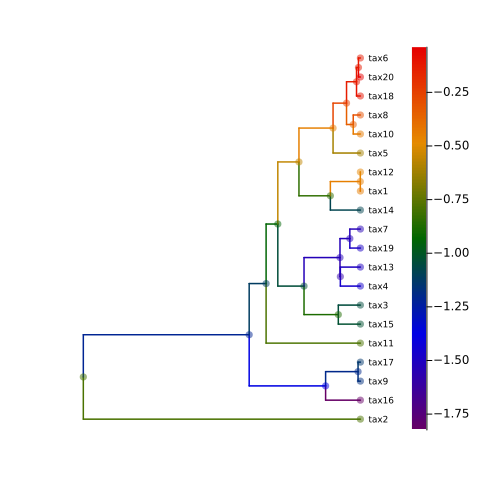
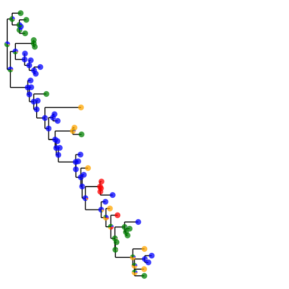
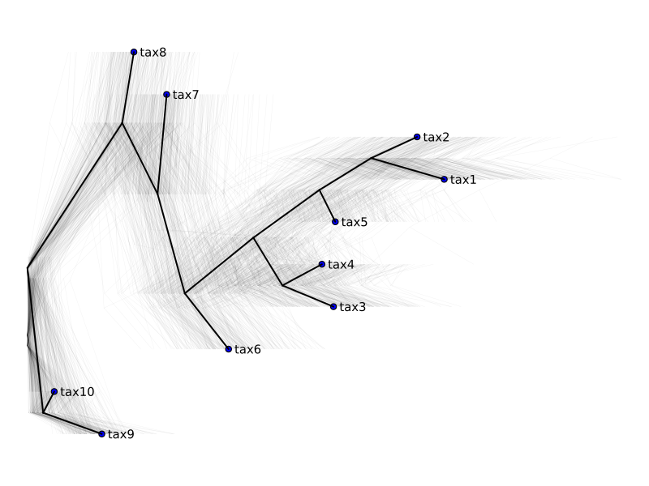
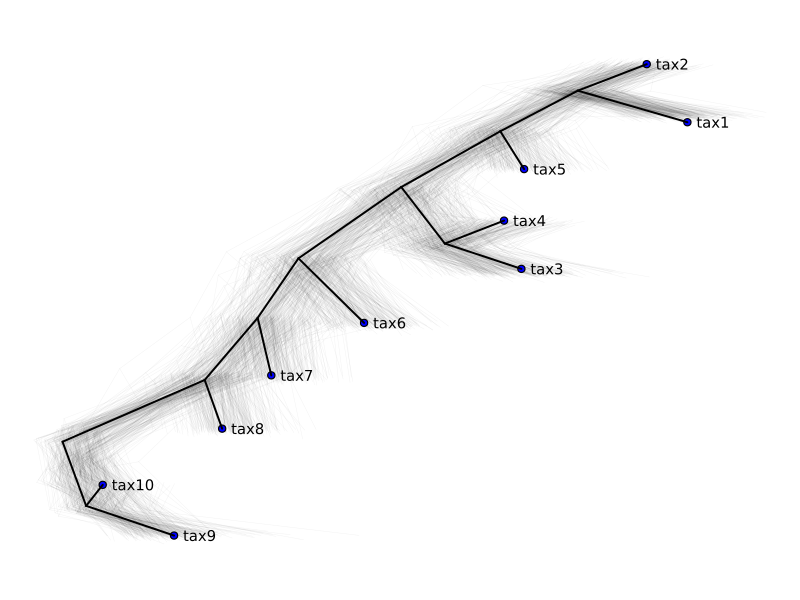

# Visualization {#Visualization}

We offer two routes to visualization. The first is using our own plotting routines, built atop Compose.jl. The second converts our trees to Phylo.jl trees, and plots with their Plots.jl recipes. The Compose, Plots, and Phylo dependencies are optional.

## Example 1 {#Example-1}

```julia
using MolecularEvolution, Plots, Phylo

#First simulate a tree, and then Brownian motion:
tree = sim_tree(n = 20)
internal_message_init!(tree, GaussianPartition())
bm_model = BrownianMotion(0.0, 0.1)
sample_down!(tree, bm_model)

#We'll add the Gaussian means to the node_data dictionaries
for n in getnodelist(tree)
    n.node_data = Dict(["mu" => n.message[1].mean])
end

#Transducing the mol ev tree to a Phylo.jl tree
phylo_tree = get_phylo_tree(tree)

pl = plot(
    phylo_tree,
    showtips = true,
    tipfont = 6,
    marker_z = "mu",
    markeralpha = 0.5,
    line_z = "mu",
    linecolor = :darkrainbow,
    markersize = 4.0,
    markerstrokewidth = 0,
    margins = 1Plots.cm,
    linewidth = 1.5,
    markercolor = :darkrainbow,
    size = (500, 500),
)
```

{width=499px height=499px}

We also offer `savefig_tweakSVG("simple_plot_example.svg", pl)` for some post-processing tricks that improve the exported trees, like rounding line caps, and `values_from_phylo_tree(phylo_tree,"mu")` which can extract stored quantities in the right order for passing into eg. `markersize` options when plotting.

For a more comprehensive list of things you can do with Phylo.jl plots, please see [their documentation](https://docs.ecojulia.org/Phylo.jl/stable/man/plotting/).

## Drawing trees with `Compose.jl`. {#Drawing-trees-with-Compose.jl.}

The `Compose.jl` in-house tree drawing offers extensive flexibility. Here is an example that plots a pie chart representing the marginal probability of each of the 4 possible nucleotides on all nodes on the tree:

```julia
using MolecularEvolution, Compose

tree = sim_tree(40, 1000.0, 0.005, mutation_rate = 0.001)
model = DiagonalizedCTMC(reversibleQ(ones(6), ones(4) ./ 4))
internal_message_init!(tree, NucleotidePartition(ones(4) ./ 4, 1))
sample_down!(tree, model)
d = marginal_state_dict(tree, model);
```


```julia
compose_dict = Dict()
for n in getnodelist(tree)
    compose_dict[n] =
        (x, y) -> pie_chart(x, y, d[n][1].state[:, 1], size = 0.02, opacity = 0.75)
end
img = tree_draw(tree,draw_labels = false, line_width = 0.5mm, compose_dict = compose_dict)
```

{width=567px height=567px}

This can then be exported with:

```julia
savefig_tweakSVG("piechart_tree.svg",img);
```


## Multiple trees {#Multiple-trees}

Doesn&#39;t require `Phylo.jl`. Query trees can be plotted against a reference tree with [`plot_multiple_trees`](/generated/viz#MolecularEvolution.plot_multiple_trees). This can be useful, for instance, when we&#39;ve sampled trees with [`metropolis_sample`](/api#MolecularEvolution.metropolis_sample-Tuple{AbstractUpdate,%20FelNode,%20Any,%20Any}).

```julia
using MolecularEvolution, Plots

tree = sim_tree(10, 1, 1)
nodelist = getnodelist(tree); mean = sum([n.branchlength for n in nodelist]) / length(nodelist)
rparams(n::Int) = MolecularEvolution.sum2one(rand(n))
model = DiagonalizedCTMC(reversibleQ(ones(6) ./ (6 * mean), rparams(4)))
internal_message_init!(tree, NucleotidePartition(ones(4) ./ 4, 100))
sample_down!(tree, model)
@time trees, LLs = metropolis_sample(tree, [model], 300, collect_LLs=true);
```


```
  5.198272 seconds (18.54 M allocations: 1.413 GiB, 8.71% gc time, 34.39% compilation time)
```


We&#39;ll use the [`HIPSTR`](/generated/viz#MolecularEvolution.HIPSTR) tree as reference

```julia
reference = HIPSTR(trees);
plot_multiple_trees(trees, reference)
```

{width=800px height=600px}

We can pass in a weight function to fit query trees against `reference` in a weighted least squares fashion with a location and scale parameter.

::: tip Note

If we don&#39;t want to scale the query trees, we must disable it with `opt_scale = false`.

:::

```julia
plot_multiple_trees(
    trees,
    reference,
    y_jitter = 0.05,
    weight_fn = n::FelNode ->
       ifelse(MolecularEvolution.isroot(n) || isleafnode(n), 1.0, 0.0)
)
```

{width=800px height=600px}

## Functions {#Functions}
<details class='jldocstring custom-block' open>
<summary><a id='MolecularEvolution.get_phylo_tree' href='#MolecularEvolution.get_phylo_tree'><span class="jlbinding">MolecularEvolution.get_phylo_tree</span></a> <Badge type="info" class="jlObjectType jlFunction" text="Function" /></summary>


```julia
get_phylo_tree(molev_root::FelNode; data_function = (x -> Tuple{String,Float64}[]))
```


Converts a FelNode tree to a Phylo tree. The `data_function` should return a list of tuples of the form (key, value) to be added to the Phylo tree `data` Dictionary. Any key/value pairs on the FelNode `node_data` Dict will also be added to the Phylo tree.


<Badge type="info" class="source-link" text="source"><a href="https://github.com/MurrellGroup/MolecularEvolution.jl/blob/e2c752a0b1a5fa2ca25a6c4589b6e4bb030ee730/src/viz/phylo_glue.jl#L45-L50" target="_blank" rel="noreferrer">source</a></Badge>

</details>

<details class='jldocstring custom-block' open>
<summary><a id='MolecularEvolution.values_from_phylo_tree' href='#MolecularEvolution.values_from_phylo_tree'><span class="jlbinding">MolecularEvolution.values_from_phylo_tree</span></a> <Badge type="info" class="jlObjectType jlFunction" text="Function" /></summary>


```julia
values_from_phylo_tree(phylo_tree, key)

Returns a list of values from the given key in the nodes of the phylo_tree, in an order that is somehow compatible with the order the nodes get plotted in.
```


<Badge type="info" class="source-link" text="source"><a href="https://github.com/MurrellGroup/MolecularEvolution.jl/blob/e2c752a0b1a5fa2ca25a6c4589b6e4bb030ee730/src/viz/phylo_glue.jl#L72-L77" target="_blank" rel="noreferrer">source</a></Badge>

</details>

<details class='jldocstring custom-block' open>
<summary><a id='MolecularEvolution.savefig_tweakSVG' href='#MolecularEvolution.savefig_tweakSVG'><span class="jlbinding">MolecularEvolution.savefig_tweakSVG</span></a> <Badge type="info" class="jlObjectType jlFunction" text="Function" /></summary>


```julia
savefig_tweakSVG(fname, plot::Plots.Plot; hack_bounding_box = true, new_viewbox = nothing, linecap_round = true)
```


Note: Might only work if you&#39;re using the GR backend!! Saves a figure created using the `Phylo` `Plots` recipe, but tweaks the SVG after export. `new_viewbox` needs to be an array of 4 numbers, typically starting at `[0 0 plot_width*4 plot_height*4]` but this lets you add shifts, in case the plot is getting cut off.

eg. `savefig_tweakSVG("export.svg",pl, new_viewbox = [-100, -100, 3000, 4500])`


<Badge type="info" class="source-link" text="source"><a href="https://github.com/MurrellGroup/MolecularEvolution.jl/blob/e2c752a0b1a5fa2ca25a6c4589b6e4bb030ee730/src/viz/phylo_glue.jl#L84-L93" target="_blank" rel="noreferrer">source</a></Badge>


```julia
savefig_tweakSVG(fname, plot::Context; width = 10cm, height = 10cm, linecap_round = true, white_background = true)
```


Saves a figure created using the `Compose` approach, but tweaks the SVG after export.

eg. `savefig_tweakSVG("export.svg",pl)`


<Badge type="info" class="source-link" text="source"><a href="https://github.com/MurrellGroup/MolecularEvolution.jl/blob/e2c752a0b1a5fa2ca25a6c4589b6e4bb030ee730/src/viz/tree_compose.jl#L1012-L1018" target="_blank" rel="noreferrer">source</a></Badge>

</details>

<details class='jldocstring custom-block' open>
<summary><a id='MolecularEvolution.tree_draw' href='#MolecularEvolution.tree_draw'><span class="jlbinding">MolecularEvolution.tree_draw</span></a> <Badge type="info" class="jlObjectType jlFunction" text="Function" /></summary>


```julia
tree_draw(tree::FelNode;
    canvas_width = 15cm, canvas_height = 15cm,
    stretch_for_labels = 2.0, draw_labels = true,
    line_width = 0.1mm, font_size = 4pt,
    min_dot_size = 0.00, max_dot_size = 0.01,
    line_opacity = 1.0,
    dot_opacity = 1.0,
    name_opacity = 1.0,
    horizontal = true,
    dot_size_dict = Dict(), dot_size_default = 0.0,
    dot_color_dict = Dict(), dot_color_default = "black",
    line_color_dict = Dict(), line_color_default = "black",
    label_color_dict = Dict(), label_color_default = "black",
    nodelabel_dict = Dict(),compose_dict = Dict()
    )
```


Draws a tree with a number of self-explanatory options. Dictionaries that map a node to a color/size are used to control per-node plotting options. `compose_dict` must be a `FelNode->function(x,y)` dictionary that returns a `compose()` struct.

Example using `compose_dict`

```julia
str_tree = "(((((tax24:0.09731668728575642,(tax22:0.08792233964843627,tax18:0.9210388482867483):0.3200367900275155):0.6948314526087965,(tax13:1.9977212308725611,(tax15:0.4290074347886068,(tax17:0.32928401808187824,(tax12:0.3860215462534818,tax16:0.2197134841232339):0.1399122681886174):0.05744611946245004):1.4686085778061146):0.20724159879522402):0.4539334554156126,tax28:0.4885576926440158):0.002162260013924424,tax26:0.9451873777301325):3.8695419798779387,((tax29:0.10062813251515536,tax27:0.27653633028085006):0.04262434258357507,(tax25:0.009345653929737636,((tax23:0.015832941547076644,(tax20:0.5550597590956172,((tax8:0.6649025646927402,tax9:0.358506423199849):0.1439516404012261,tax11:0.01995439013213013):1.155181296134081):0.17930021667907567):0.10906638146207207,((((((tax6:0.013708993438720255,tax5:0.061144001556547097):0.1395453591567641,tax3:0.4713722705245479):0.07432598428904214,tax1:0.5993347898257291):1.0588025698844894,(tax10:0.13109032492533992,(tax4:0.8517302241963356,(tax2:0.8481963081549965,tax7:0.23754095940676642):0.2394313086297733):0.43596704123297675):0.08774657269409454):0.9345533723114966,(tax14:0.7089558245245173,tax19:0.444897137240675):0.08657675809803095):0.01632062723968511,tax21:0.029535281963725537):0.49502691718938285):0.25829576024240986):0.7339777396780424):4.148878039524972):0.0"
newt = gettreefromnewick(str_tree, FelNode)
ladderize!(newt)
compose_dict = Dict()
for n in getleaflist(newt)
    #Replace the rand(4) with the frequencies you actually want.
    compose_dict[n] = (x,y)->pie_chart(x,y,MolecularEvolution.sum2one(rand(4)),size = 0.03)
end
tree_draw(newt,draw_labels = false,line_width = 0.5mm, compose_dict = compose_dict)


img = tree_draw(tree)
img |> SVG("imgout.svg",10cm, 10cm)
OR
using Cairo
img |> PDF("imgout.pdf",10cm, 10cm)
```


<Badge type="info" class="source-link" text="source"><a href="https://github.com/MurrellGroup/MolecularEvolution.jl/blob/e2c752a0b1a5fa2ca25a6c4589b6e4bb030ee730/src/viz/tree_compose.jl#L137-L177" target="_blank" rel="noreferrer">source</a></Badge>

</details>

<details class='jldocstring custom-block' open>
<summary><a id='MolecularEvolution.plot_multiple_trees' href='#MolecularEvolution.plot_multiple_trees'><span class="jlbinding">MolecularEvolution.plot_multiple_trees</span></a> <Badge type="info" class="jlObjectType jlFunction" text="Function" /></summary>


```julia
plot_multiple_trees(trees, inf_tree; <keyword arguments>)
```


Plots multiple phylogenetic trees against a reference tree, `inf_tree`. For each **tree** in `trees`, a linear Weighted Least Squares (WLS) problem (parameterized by the `weight_fn` keyword) is solved for the x-positions of the matching nodes between `inf_tree` and **tree**.

**Keyword Arguments**
- `node_size=4`: the size of the nodes in the plot.
  
- `line_width=0.5`: the width of the branches from `trees`.
  
- `font_size=10`: the font size for the leaf labels.
  
- `margin=1.5`: the margin between a leaf node and its label.
  
- `line_alpha=0.05`: the transparency level of the branches from `trees`.
  
- `y_jitter=0.0`: the standard deviation of the noise in the y-coordinate.
  
- `weight_fn=n::FelNode -> ifelse(isroot(n), 1.0, 0.0))`: a function that assigns a weight to a node for the WLS problem.
  
- `opt_scale=true`: whether to include a scaling parameter for the WLS problem.
  


<Badge type="info" class="source-link" text="source"><a href="https://github.com/MurrellGroup/MolecularEvolution.jl/blob/e2c752a0b1a5fa2ca25a6c4589b6e4bb030ee730/src/viz/multiple_trees.jl#L74-L89" target="_blank" rel="noreferrer">source</a></Badge>

</details>

<details class='jldocstring custom-block' open>
<summary><a id='MolecularEvolution.HIPSTR' href='#MolecularEvolution.HIPSTR'><span class="jlbinding">MolecularEvolution.HIPSTR</span></a> <Badge type="info" class="jlObjectType jlFunction" text="Function" /></summary>


```julia
HIPSTR(trees::Vector{FelNode}; set_branchlengths = true)
```


Construct a Highest Independent Posterior Subtree Reconstruction (HIPSTR) tree from a collection of trees.

Returns a single FelNode representing the HIPSTR consensus tree.

If `set_branchlengths = true`, the branch length of a node in the HIPSTR tree will be set to the mean branch length of all nodes from the input trees that have the same clade. (By the same clade, we mean that the set of leaves below the node is the same.) Otherwise, the root branch length is 0.0 and the rest 1.0.

Source: https://www.biorxiv.org/content/10.1101/2024.12.08.627395v1.full.pdf


<Badge type="info" class="source-link" text="source"><a href="https://github.com/MurrellGroup/MolecularEvolution.jl/blob/e2c752a0b1a5fa2ca25a6c4589b6e4bb030ee730/src/utils/HIPSTR.jl#L2-L13" target="_blank" rel="noreferrer">source</a></Badge>

</details>


---


_This page was generated using [Literate.jl](https://github.com/fredrikekre/Literate.jl)._
