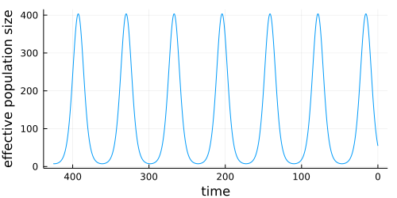

# Simulation {#Simulation}

The two key steps in phylogenetic simulation are 1) simulating the phylogeny itself, and 2) simulating data that evolves over the phylogeny.

## Simulating phylogenies {#Simulating-phylogenies}

::: warning Warning

While our `sim_tree` function seems to produce trees with the right shape, and is good enough for eg. generating varied tree shapes to evaluate different phylogeny inference schemes under, it is not yet sufficiently checked and tested for use where the details of the coalescent need to be absolutely accurate. It could, for example, be off by a constant factor somewhere. So if you plan on using this in a such a manner for a publication, please check the `sim_tree` code (and let us know).

:::

If you just need a simple tree for testing things, then you can just use:

```julia
tree = sim_tree(n=100)
tree_draw(tree, draw_labels = false, canvas_height = 5cm)
```


This has the characteristic &quot;coalescent under constant population size&quot; look.

However, `sim_tree` is a bit more powerful than this: it aims to simulate branching under a coalescent process with flexible options for how the effective population size, as well as the sampling rate, might change over time. This is important, because the &quot;constant population size&quot; model is quite extreme, and most of the divergence happens in the early internal branches.

A coalescent process runs backwards in time, starting from the most recent tip, and sampling backwards toward the root, coalescing nodes as it goes, and sometimes adding additional sampled tips. With `sim_tree`, if `nstart = add_limit`, then all the tips will be sampled at the same time, and the tree will be ultrametric.

`sim_tree` has two arguments driving its flexibility. We&#39;ll start with `sampling_rate`, which controls the rate at which samples are added to the tree. Even under constant effective population size, this can produce interesting behavior.

```julia
for sampling_rate in [5.0, 0.5, 0.05, 0.005]
    tree = sim_tree(100,1000.0,sampling_rate)
    display(tree_draw(tree, draw_labels = false, canvas_height = 5cm))
end
```


Above, this rate was just a fixed constant value, but we can also let this be a function. In this example, we&#39;ll plot the tree alongside the sampling rate function, as well as the cumulative number of samples through time.

```julia
s(t) = ifelse(0<mod(t/10,10)<1,10.0,0.0)
tree = sim_tree(500,500.0,s)
display(tree_draw(tree, draw_labels = false, canvas_height = 5cm, canvas_width = 14cm))

#Figure out how tall the tree is
root_dists,_ = MolecularEvolution.root2tip_distances(tree)
mrd = maximum(root_dists)
sample_times = mrd .- root_dists
xvals = 0.0:0.1:mrd
display(plot(xvals,s, xflip = true, size = (500,250), xlabel = "time",ylabel = "sampling rate", legend = :none))
display(plot(xvals,x -> sum(x .> sample_times), xflip = true, size = (500,250), xlabel = "time",ylabel = "cumulative samples", legend = :none))
```


Note how the x axis of these plots is flipped, since the leaf furtherest from the root begins at time=0, and the coalescent runs backwards, from tip to root.

We can also vary the effective population size over time, which adds a different dimension of control. Here is an example showing the shape of a tree under exponential growth:

```julia
n(t) = 100000*exp(-t/10)
tree = sim_tree(100,n,100.0, nstart = 100)
display(tree_draw(tree, draw_labels = false, canvas_height = 7cm, canvas_width = 14cm))

root_dists,_ = MolecularEvolution.root2tip_distances(tree)
plot(0.0:0.1:maximum(root_dists),n, xflip = true, size = (500,250), xlabel = "time",ylabel = "effective population size", legend = :none)
```


Logistic growth, with a relatively low sampling rate, provides a reasonable model of an emerging virus that was only sampled later in its growth trajectory, such as HIV.

```julia
n(t) = 10000/(1+exp(t-10))
tree = sim_tree(100,n,20.0)
display(tree_draw(tree, draw_labels = false, canvas_height = 7cm, canvas_width = 14cm))

root_dists,_ = MolecularEvolution.root2tip_distances(tree)
display(plot(0.0:0.1:maximum(root_dists),n, xflip = true, size = (500,250), xlabel = "time",ylabel = "effective population size", legend = :none))

mrd = maximum(root_dists)
sample_times = mrd .- root_dists
plot(0.0:0.1:mrd,x -> sum(x .> sample_times), xflip = true, size = (500,250), xlabel = "time",ylabel = "cumulative samples", legend = :none)
```


How about a virus with a seasonally varying effective population size, where sampling is proportional to case counts? Between seasons, the effective population size gets so low that the next seasons clade arises from a one or two lineages in the previous season.

```julia
n(t) = exp(sin(t/10) * 2.0 + 4)
s(t) = n(t)/100
tree = sim_tree(500,n,s)
display(tree_draw(tree, draw_labels = false))


root_dists,_ = MolecularEvolution.root2tip_distances(tree)
display(plot(0.0:0.1:maximum(root_dists),n, xflip = true, size = (500,250), xlabel = "time",ylabel = "effective population size", legend = :none))

mrd = maximum(root_dists)
sample_times = mrd .- root_dists
plot(0.0:0.1:mrd,x -> sum(x .> sample_times), xflip = true, size = (500,250), xlabel = "time",ylabel = "cumulative samples", legend = :none)
```





Finally, the `mutation_rate` argument multiplicatively scales the branch lengths.

## Simulating evolution over phylogenies {#Simulating-evolution-over-phylogenies}

We&#39;ll begin by simulating a tree, like the last example:

```julia
using MolecularEvolution, FASTX, Phylo, Plots, CSV, DataFrames

n(t) = exp(sin(t/10) * 2.0 + 4)
s(t) = n(t)/100
tree = sim_tree(500,n,s, mutation_rate = 0.005)
```


If we need to open this tree in an external program, we can extract the Newick string representing this tree, and write it to a file:

```julia
newick_string = newick(tree)
open("flu_sim.tre","w") do io
   println(io,newick_string)
end
```


Then we can set up a model. In this case, it&#39;ll be a combination of a nucleotide model of sequence evolution and Brownian motion over a continuous character.

```julia
nuc_freqs = [0.2,0.3,0.3,0.2]
nuc_rates = [1.0,2.0,1.0,1.0,1.6,0.5]
nuc_model = DiagonalizedCTMC(reversibleQ(nuc_rates,nuc_freqs))
bm_model = BrownianMotion(0.0,1.0)
```


As usual, we set up the `Partition` structure, and load this onto our tree:

```julia
message_template = [NucleotidePartition(nuc_freqs,300),GaussianPartition()]
internal_message_init!(tree, message_template)
```


Then we sample data under our model:

```julia
sample_down!(tree, [nuc_model,bm_model])
```


We&#39;ll can visualize the Brownian component of the simulation by loading it into the `node_dict`, and converting to a `Phylo.jl` tree.

```julia
for n in getnodelist(tree)
    n.node_data = Dict(["mu"=>n.message[2].mean])
end
phylo_tree = get_phylo_tree(tree)
plot(phylo_tree, showtips = false, line_z = "mu", colorbar = :none,
    linecolor = :darkrainbow, linewidth = 1.0, size = (600, 600))
```


We can write the simulated data, including sequences and continuous characters, to a CSV:

```julia
df = DataFrame()
df.names = [n.name for n in getleaflist(tree)]
df.seqs = [partition2obs(n.message[1]) for n in getleaflist(tree)]
df.mu = [partition2obs(n.message[2]) for n in getleaflist(tree)]
CSV.write("flu_sim_seq_and_bm.csv",df)
```


Or we could export just the sequences as .fasta

```julia
write_fasta("flu_sim_seq_and_bm.fasta",df.seqs,seq_names = df.names)
```


Which will look something like this, when opened in [AliView](https://ormbunkar.se/aliview/)


## Functions {#Functions}
<details class='jldocstring custom-block' open>
<summary><a id='MolecularEvolution.sim_tree' href='#MolecularEvolution.sim_tree'><span class="jlbinding">MolecularEvolution.sim_tree</span></a> <Badge type="info" class="jlObjectType jlFunction" text="Function" /></summary>


```julia
sim_tree(add_limit::Int,Ne_func,sample_rate_func; nstart = 1, time = 0.0, mutation_rate = 1.0, T = Float64)
```


Simulates a tree of type FelNode{T}. Allows an effective population size function (Ne_func), as well as a sample rate function (sample_rate_func), which can also just be constants.

Ne_func(t) = (sin(t/10)+1)*100.0 + 10.0 root = sim_tree(600,Ne_func,1.0) simple_tree_draw(ladderize(root))


<Badge type="info" class="source-link" text="source"><a href="https://github.com/MurrellGroup/MolecularEvolution.jl/blob/e2c752a0b1a5fa2ca25a6c4589b6e4bb030ee730/src/core/sim_tree.jl#L94-L103" target="_blank" rel="noreferrer">source</a></Badge>


```julia
sim_tree(;n = 10)
```


Simulates tree with constant population size.


<Badge type="info" class="source-link" text="source"><a href="https://github.com/MurrellGroup/MolecularEvolution.jl/blob/e2c752a0b1a5fa2ca25a6c4589b6e4bb030ee730/src/core/sim_tree.jl#L132-L137" target="_blank" rel="noreferrer">source</a></Badge>

</details>

<details class='jldocstring custom-block' open>
<summary><a id='MolecularEvolution.sample_down!' href='#MolecularEvolution.sample_down!'><span class="jlbinding">MolecularEvolution.sample_down!</span></a> <Badge type="info" class="jlObjectType jlFunction" text="Function" /></summary>


sample_down!(root::FelNode,models,partition_list)

Generates samples under the model. The root.parent_message is taken as the starting distribution, and node.message contains the sampled messages. models can either be a single model (if the messages on the tree contain just one Partition) or an array of models, if the messages have &gt;1 Partition, or  a function that takes a node, and returns a Vector{&lt;:BranchModel} if you need the models to vary from one branch to another. partition_list (eg. 1:3 or [1,3,5]) lets you choose which partitions to run over.


<Badge type="info" class="source-link" text="source"><a href="https://github.com/MurrellGroup/MolecularEvolution.jl/blob/e2c752a0b1a5fa2ca25a6c4589b6e4bb030ee730/src/core/algorithms/generative.jl#L14-L21" target="_blank" rel="noreferrer">source</a></Badge>

</details>

<details class='jldocstring custom-block' open>
<summary><a id='MolecularEvolution.partition2obs' href='#MolecularEvolution.partition2obs'><span class="jlbinding">MolecularEvolution.partition2obs</span></a> <Badge type="info" class="jlObjectType jlFunction" text="Function" /></summary>


```julia
partition2obs(part::Partition)
```


Extracts the most likely state from a Partition, transforming it into a convenient type. For example, a NucleotidePartition will be transformed into a nucleotide sequence of type String. Note: You should overload this for your own Partititon types.


<Badge type="info" class="source-link" text="source"><a href="https://github.com/MurrellGroup/MolecularEvolution.jl/blob/e2c752a0b1a5fa2ca25a6c4589b6e4bb030ee730/src/models/discrete_models/utils/seq_to_vec.jl#L70-L76" target="_blank" rel="noreferrer">source</a></Badge>

</details>

